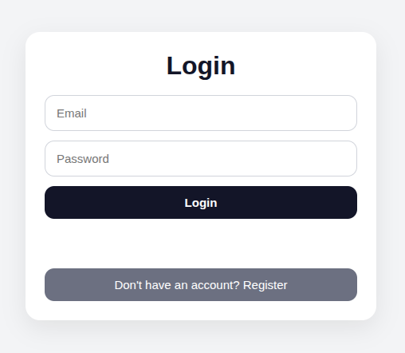
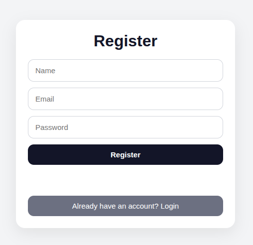

# Full Stack ToDo Application

A full-stack ToDo application built with Spring Boot, React, PostgreSQL, and JWT Authentication.

## Tech Stack

### Backend
- Java 17
- Spring Boot
- Spring Security
- Spring Data JPA
- PostgreSQL
- JWT
- Maven

### Frontend
- React
- Vite
- Axios
- React Router

## Features

- User registration
- User login
- JWT authentication
- Protected routes
- Create, update, delete tasks
- Mark tasks as completed
- Search, filter, sort, and paginate tasks

# Screenshots

## Login Page



---

## Register Page



---

## Dashboard


## Project Structure

```bash
fullstack-todo-app/
├── backend/
├── frontend/
└── README.md

