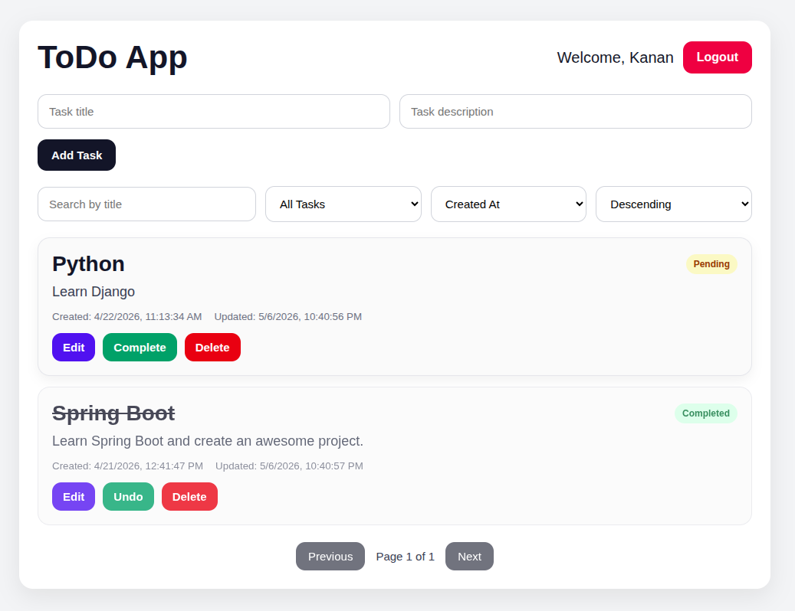

# Frontend - React ToDo Application

Frontend application for the Full Stack ToDo project.

---

# 🚀 Overview

This frontend application was built with React and Vite.
It communicates with the Spring Boot backend using REST APIs and JWT Authentication.

The application allows users to:

- Register and login
- Manage personal tasks
- Create, update, and delete tasks
- Search and filter tasks
- Access protected pages using JWT authentication

---

# 🛠️ Tech Stack

- React
- Vite
- Axios
- React Router DOM
- CSS3
- JavaScript (ES6+)

---

# ✨ Features

## Authentication

- User registration
- User login
- JWT token storage
- Protected routes
- Logout functionality

## Task Management

- Create tasks
- Edit tasks
- Delete tasks
- Mark tasks as completed
- Search tasks
- Filter tasks
- Pagination support
- Sorting support

## UI Features

- Responsive design
- Clean modern interface
- Error handling
- Loading states
- Form validation

---

# 📂 Folder Structure

```text
src/
│
├── components/
├── pages/
├── services/
├── routes/
├── hooks/
├── assets/
└── styles/
```

---

# ⚙️ Installation

## 1. Clone Repository

```bash
git clone https://github.com/yourusername/fullstack-todo-app.git
```

---

## 2. Navigate to Frontend

```bash
cd frontend
```

---

## 3. Install Dependencies

```bash
npm install
```

---

# 🔧 Environment Variables

Create:

```bash
.env
```

Add:

```env
VITE_API_BASE_URL=http://localhost:8080
```

---

# ▶️ Run Application

```bash
npm run dev
```

Frontend runs on:

```text
http://localhost:5173
```

---

# 🔐 Authentication Flow

```text
User Login
    ↓
JWT Token Received
    ↓
Token Stored in Local Storage
    ↓
Protected API Requests
    ↓
Access Granted
```

---

# 📡 Backend Connection

This frontend communicates with the Spring Boot backend API.

Backend default URL:

```text
http://localhost:8080
```

---

# 📸 Screenshots

Add screenshots to improve recruiter experience.

Example:

```md
## Dashboard

```

Recommended screenshots:

- Login page
- Register page
- Task dashboard
- Mobile responsive view

---

# 🌍 Deployment

Recommended frontend deployment platforms:

- Vercel
- Netlify
- Firebase Hosting

---

# 💡 Future Improvements

Potential improvements:

- Dark mode
- Drag & drop tasks
- Real-time updates
- Task categories
- Due dates & reminders
- Better animations

---

# 👨‍💻 Author

Your Name

GitHub: https://github.com/kanangasimli

LinkedIn: https://linkedin.com/in/kanangasimli
